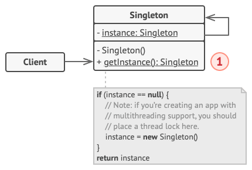

# Singleton

## [Mục lục](#mục-lục)
- [Tổng quan](#tổng-quan)
- [Motivation](#motivation)
- [Đặc điểm](#đặc-điểm)
    - [Cấu trúc](#cấu-trúc)
    - [Các thành phần](#các-thành-phần)
    - [Cách sử dụng](#cách-sử-dụng)
    - [Ứng dụng](#ứng-dụng)
    - [Ưu điểm](#ưu-điểm)
    - [Nhược điểm](#nhược-điểm)
    - [Ví dụ minh họa](#ví-dụ-minh-họa)
    - [Các mẫu liên quan](#các-mẫu-liên-quan)
- [Kết luận]()

## [Tổng quan]()

```
Singleton là một mẫu thiết kế cấu trúc creational pattern, mục đích của nó là để đảm bảo rằng một lớp chỉ có một thể hiện(instance) duy nhất. Vì thể hiện này có tiềm năng ứng dụng và sử dụng trong suốt chương trình, nên mẫu thiết kế này cũng cấp một điểm để truy cập toàn cục tới nó
```

## [Motivation]()
- Trong quá trình coding chúng ta sẽ gắp những trường hợp mong muốn có một và chỉ một đối tượng duy nhất truy xuất tới nhiều nơi đồng thời tiết kiệm bộ nhớ. Ví dụ khi làm việc với MVP, MVVM, ... chúng ta muốn tạo ra 1 đối tượng repository để vừa có thể execute tới database, vừa có thể truy xuất tới các class để thao tác API. Trong trường hợp này Singleton sẽ giúp chúng ta giải quyết vấn đề này.

- Singleton giải quyết được 2 vấn đề cùng một lúc:
    - Đảm bảo rằng một lớp chỉ có một thể hiện duy nhất.
    - Cung cấp một điểm truy cập toàn cục tới thể hiện đó.

        * Lưu ý: Khi thao tác với Singleton thì không thể thực hiện với một constructor thông thường vì khi gọi constructor thì phải luôn trả về đối tượng theo bản thiết kế, mà phải thao tác với một hàm static để trả về thể hiện duy nhất.

    - Singleton cung cấp một cách để truy cập toàn cục tới thể hiện của nó thông qua một hàm static. Điều này giúp chúng ta truy cập tới thể hiện của nó mà không cần phải tạo một thể hiện mới.
        * Lưu ý: Chỉ tạo method static để trả về thể hiện duy nhất, không tạo constructor thông thường, và cũng không tạo method để thay đổi instance đó

## [Đặc điểm]()

### [Cấu trúc]()

### [Các thành phần]()
- Lớp Singleton khai báo phương thức static getInstance() để trả về cùng một thể hiện của lớp riêng của nó.
- Constructor của lớp Singleton phải là private hoặc nên được ẩn khỏi mã máy khách hàng để ngăn chặn việc tạo thể hiện mới từ bên ngoài lớp.
- Gọi phương thức getInstance() phải là cách duy nhất để lấy thể hiện của lớp Singleton.
### [Cách sử dụng]()

### [Ứng dụng]()

### [Ưu điểm]()
- Có thể chắc chắn đảm bảo rằng lớp Singleton chỉ có một instance
- Cung cấp một điểm truy cập toàn cục tới instance đó(global access point) và có thể kiểm soát hoàn toàn việc truy cập đó
- Thể hiện Singleton chỉ được khởi tạo duy nhất một lần khi nó được yêu cầu lần đầu tiên
- Có thể giảm số lượng namespace trong chương trình
### [Nhược điểm]()
- Vi phạm SRP (Single Responsibility Principle) vì Singleton cần phải quản lý cả việc tạo thể hiện và việc thực thi chức năng của nó
- Khó kiểm soát việc mở rộng lớp Singleton
- Singleton có thể thể hiện thiết kế kém
- Có thể sinh ra khó khăn trong việc unit test client code vì nhiều test framework dựa vào kế thừa khi sản sinh các mock object
### [Ví dụ minh họa]()
```java
public class Singleton {
    private static Singleton instance;
    private Singleton() {
    }
    public static Singleton getInstance() {
        if (instance == null) {
            instance = new Singleton();
        }
        return instance;
    }
}
```

### [Các mẫu liên quan]()

## [Kết luận]()
```
Singleton là một mẫu thiết kế cấu trúc creational pattern, mục đích của nó là để đảm bảo rằng một lớp chỉ có một thể hiện(instance) duy nhất. Vì thể hiện này có tiềm năng ứng dụng và sử dụng trong suốt chương trình, nên mẫu thiết kế này cũng cấp một điểm để truy cập toàn cục tới nó
```